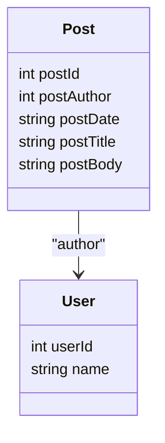

# dio-api-2024

## Diagrama de Classes

```mermaid
  classDiagram
      class Post {
          int postId
          int postAuthor
          string postDate
          string postTitle
          string postBody
      }
    class User {
        int userId
        string name
    }
    
    Post --> User : "author"
```
